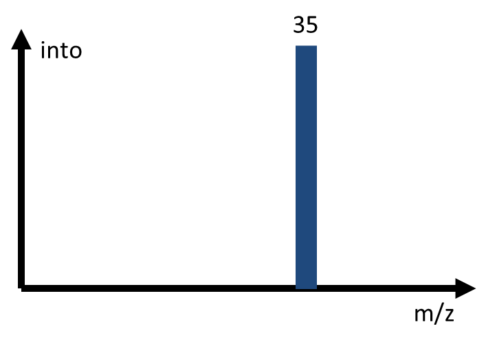
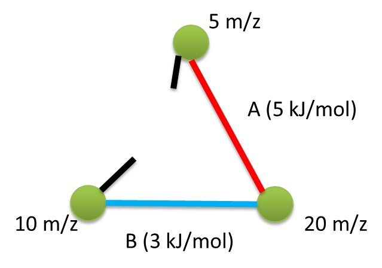
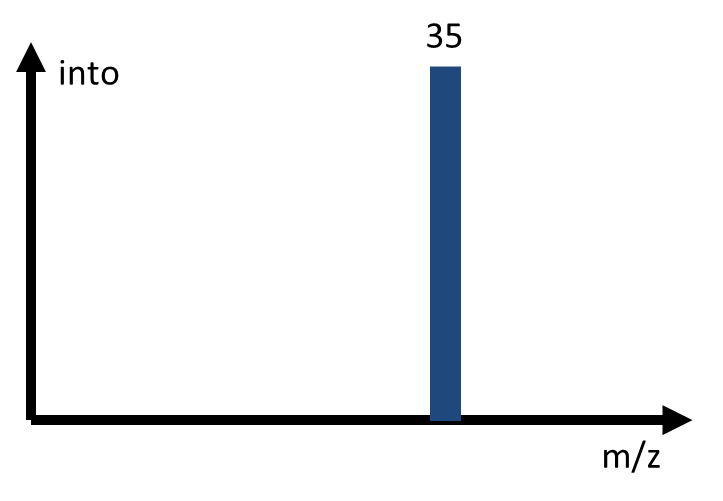
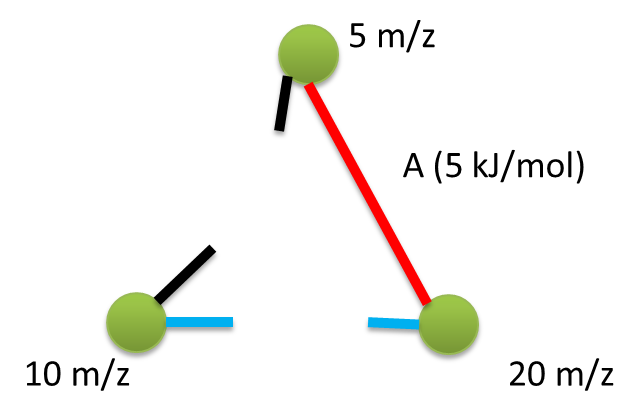
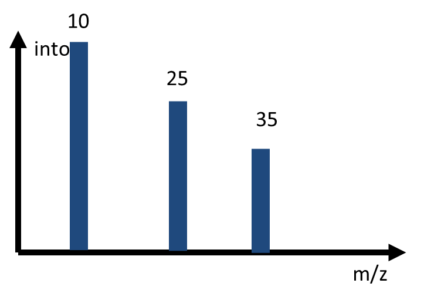
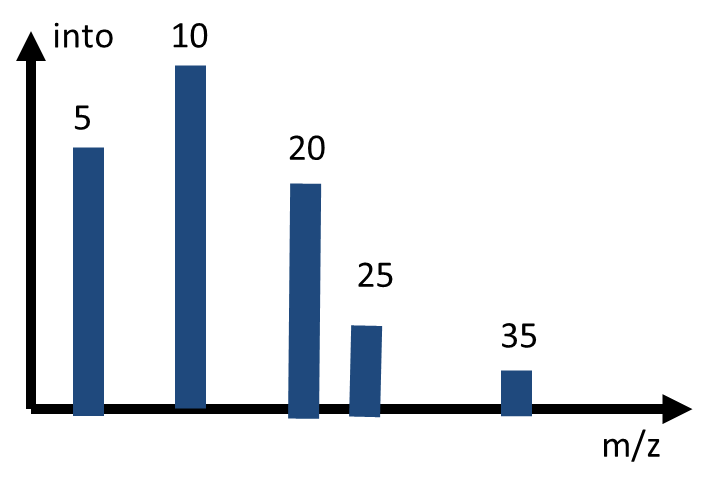

# 质谱二级碎片模拟

对于任意一种化合物，都是由若干个官能团（原子基团），构成的。这些原子基团之间通过化学键连接，形成了整个化合物的分子。不同的化学键的能量大小不一样，这也就意味着这些化学键断裂所需要的最小的能量是不一样的。对于二级质谱而言，其最基本的工作原理就是通过离子轰击化合物分子，给与化学键的断裂能量，将整个分子通过轰击碎裂化为不同的原子基团，这些分子基团由于所组成的原子的数量以及种类不完全相同，故而他们的分子的质量也不尽相同，故而在磁场之中的飞行的时间也不尽相同。故而通过二级质谱可以通过飞行时间来计算出基团的``m/z``，通过这些计算出来的基团质量``m/z``的分布情况来了解分子的结构或者将这些``m/z``分布作为化合物分子的一种特征进行二级质谱比较来完成物质的鉴定。

## 使用图理论模拟二级质谱碎片

假设我们现在对分子化合物进行简化处理，将原子基团之间的化学键定义为图之中的边，将图之中的节点定义为一个需要很大的能量才能够进行分割的分子基团，那么一个分子化合物就可以看作为一个由原子基团，以及基团之间的化学键所构成的网络。那么二级质谱之中的碎片化的过程就可以看作为网络如何断裂为独立的子网络模块的过程。

我们假设将二级质谱之中的碎片化阶段的分子碰撞的过程看作为一个概率过程，则网络之中的边的断裂则可以看作为一个``[0-1]``的概率区间内所发生的事件。化学键断裂所需要的能量越低，则其发生断裂的概率就越高，则该化学键所连接的两个原子基团相互分离的概率也就越高。即整个分子化合物分裂碎片化为两个``m/z``大小的碎片的概率也就越高。这就表现为这两个``m/z``分子碎片的二级质谱之中相对应的``intensity``响应度值越高。

## 模拟质谱二级碎片所要解决的问题

基于图理论进行质谱二级碎片的模拟之中，所需要解决的问题有：

1. 化学键边的断裂将会将图网络分割为哪些子网络？即化学键的断裂将会产生哪些``m/z``分子质量的分子碎片？
2. 如何将断裂能量转换为断裂的概率高低？即如何从键的断裂能量转换为相应所产生的``m/z``的分子碎片的``intensity``响应度值？

+ http://www2.chemistry.msu.edu/faculty/reusch/VirtTxtJml/react2.htm
+ https://courses.lumenlearning.com/boundless-chemistry/chapter/activation-energy-and-temperature-dependence/
+ https://en.wikipedia.org/wiki/Collision_theory

##

由于在分子碎片的生成的过程之中，单独的分子会得到不同的能量（可能是正态分布）。对于获得较低的断裂能量的分子而言，其将不会产生分子碎片。故而在质谱结果之中，完整的分子和分子碎片通常会混合在一起而被检测出来，相应的表现在质谱信号图之中，则是通常在质谱图上面最右边的信号响应，即mz值最大的信号响应的mz等于完整的分子的mz比值：

> 例如ADP物质的质谱图所示：ADP的分子质量约为428.0344，由于在进行质谱碎片化的过程之中，部分ADP分子获取得到的能量要低于断裂能量，故而这部分ADP分子并没有发生碎片化，所以最右边的分子的质谱信号的mz比值约等于其分子质量428.04

## 使用遗传算法构建质谱模拟器

现在假若有如下的分子：目标分子总共有3个碳原子基团，这三个碳原子基团之间存在3个化学键。我们假设这三个原子基团的分子质量是不一样的，分别为5``mz``, 10``mz``和20``mz``。对应的化学键的断裂能量也分别为1, 3, 5 ``kj/mol``。

在遗传算法质谱模拟器之中我们做出下列的假设：

1. 分子以及其分子碎片在真空中都是无形状的质点，故而，只要他们的质核比一致，无论形状怎样或者外表结构如何，这些碎片在磁场中的飞行时间都应该是一样的。
2. 分子所获取得到的化学键断裂能量是和碰撞电压相关的，碰撞电压越高，所获取得到的断裂能量越高
3. 分子或者分子碎片获取得到的能量的分布符合正态分布

### 0V 碰撞电压

在0V碰撞电压下，假设分子所获取得到的化学键的断裂能量为0``kj/mol``，由于0``kj/mol``小于目标分子之中的所有的化学键断裂所需要的能量值，所以这个时候分子将不会产生任何碎片化，目标分子将会以完整的分子的形式被检测到，这表现在质谱结果图上面，只有一个和目标分子的质核比相等的信号柱被检测出来。

> 因为在0V碰撞电压之下，所有分子获取得到的断裂能量为0，故而将不会有任何化学键断裂发生，即目标分子不会发生任何碎片化，故而表现在质谱图上面只有一个与目标分子的质核比一致的完整分子的信号响应被检测到

### 10V 碰撞电压

我们假设在10V碰撞电压之下，分子所能够获得的断裂能量为1``kj/mol``，这个断裂能量只满足了C化学键断裂所需的最小能量，故而会有一部分的分子之中的C化学键发生了断裂。但是由于只有C化学键发生了断裂，其他的化学键由于能量还没有达到最低的能量阈值，故而，整个分子实际上还是连在一起的，没有分子基团脱离下来。由于我们假设在真空之中分子仅为一个质点，飞行时间和质量与电荷有关，故而尽管分子中的C化学键发生了断裂，但是由于并没有导致分子基团的脱离，所以分子的质量实际上是没有发生变化的。故而最终所得到的质谱图上任然显示只有一个和分子的质量相等的信号响应被检测到。

> 10V电压下的断裂能量只满足了C化学键的断裂，故而整个分子实际上分子质量并没有发生改变，发生改变的仅为分子的形状。故而所检测到的质谱图与0V电压下的质谱图大致一样

### 20V 碰撞电压

我们假设在20V碰撞电压之下，分子所能够获得到的断裂能量达到了3``kj/mol``，这个断裂能量高于C化学键的断裂能量，同时也满足B化学键断裂所需求的最低能量值。故而在这种情况下C化学键将会完全发生断裂，B化学键也会在部分分子之中发生断裂，有一部分分子由于我们假设能量的分布服从正态分布的原因，能够获取得到的能量是低于3``kj/mol``。故而任然会有一部分分子式完整的分子。在质谱图上面将会出现：

1. BC化学键都断裂：一个10``m/z``大小的基团的信号响应和一个25``m/z``大小的基团的信号响应；
2. 部分分子获取的能量低于3``kj/mol``，故而只有C化学键断裂，此时任然是完整的35``m/z``的信号响应。但是由于这部分的分子是占少数的，故而这部分的信号响应值将会比较低。

### 30V 碰撞电压

在30V碰撞电压下，我们假设分子所能够获取得到的能量为5``kj/mol``。由于这个能量满足了ABC这三个化学键的断裂能量，故而理想的情况下，ABC三个化学键将会同时发生断裂。但是由于我们假设每一个分子所获取得到的能量值是服从正态分布的，故而可能会有一部分的分子获取得到的碰撞能量较低，可能会低于5``kj/mol``，也可能会低于3``kj/mol``，甚至没有得到能量。故而，在这个电压下，我们所获取得到的质谱图可能为：

1. ABC三个化学键都发生了断裂，则质谱图上面将会最少出现3个信号响应：5``m/z``, 10``m/z``和20``m/z``。
2. 有一部分的分子获取得到的能量可能会低于5``kj/mol``，故而这部分的分子之中只有BC化学键发生了断裂，故而这个时候，质谱图上面会出现10``m/z``和25``m/z``的分子碎片。但是由于这部分的分子占少数，所以这两个碎片的信号响应强度要低一些。
3. 更加极端的情况是，会有更加少数的分子获取得到的碰撞能量为1``kj/mol``甚至没有获得碰撞能量。故而这个时候仍然会存在35``m/z``的信号响应，由于这部分的分子数量非常少，所以35``m/z``信号响应强度是非常低的。

## 遗传算法拟合质谱模拟参数

拟合对象：分子能量分布的概率密度函数的参数
优化目标：通过能量分布的概率密度函数预测出的质谱图与标准品的质谱图的余弦相似度结果接近于1

余弦相似度计算公式：SSM = Sum(q * s) / Sqrt(Sum(q ^ 2) * Sum(s ^ 2))