<link rel="manifest" href="/manifest.json">

# <span style="font-size: 3em;">Mzkit</span> [](https://doi.org/10.5281/zenodo.4456618)

> Data toolkits for processing NMR, MALDI MSI, LC-MS and GC-MS raw data, chemistry data analysis and data visualization.


``Mzkit`` is an open source raw data file toolkit for mass spectrometry data analysis, provides by the ``BioNovoGene`` corporation. The features of mzkit inlcudes: raw data file content viewer(XIC/TIC/Mass spectrum plot/MS-Imaging), build molecule network, formula de-novo search, de-novo annotation of the unknown metabolite features and targeted data quantification.

+ [View User Manual PowerPoint](https://view.officeapps.live.com/op/view.aspx?src=https://mzkit.org/src/mzkit/man.pptx)
+ [View Mzkit Update History](HISTORY.md)
+ Found me at: https://bio.tools/mzkit 

**Download Software**: [http://www.biodeep.cn/downloads?lang=en-US](http://www.biodeep.cn/downloads?lang=en-US)

## LICENSE

+ MZKit® is a registered trademark of BioNovoGene Corporation, protected by copyright law and international treaties.
+ **RawFileReader reading tool. Copyright © 2016 by Thermo Fisher Scientific, Inc. All rights reserved.**

```
MIT License

Copyright (c) 2018 gg.xie@bionovogene.com, BioNovoGene Co., LTD.

Permission is hereby granted, free of charge, to any person obtaining a copy
of this software and associated documentation files (the "Software"), to deal
in the Software without restriction, including without limitation the rights
to use, copy, modify, merge, publish, distribute, sublicense, and/or sell
copies of the Software, and to permit persons to whom the Software is
furnished to do so, subject to the following conditions:

The above copyright notice and this permission notice shall be included in all
copies or substantial portions of the Software.

THE SOFTWARE IS PROVIDED "AS IS", WITHOUT WARRANTY OF ANY KIND, EXPRESS OR
IMPLIED, INCLUDING BUT NOT LIMITED TO THE WARRANTIES OF MERCHANTABILITY,
FITNESS FOR A PARTICULAR PURPOSE AND NONINFRINGEMENT. IN NO EVENT SHALL THE
AUTHORS OR COPYRIGHT HOLDERS BE LIABLE FOR ANY CLAIM, DAMAGES OR OTHER
LIABILITY, WHETHER IN AN ACTION OF CONTRACT, TORT OR OTHERWISE, ARISING FROM,
OUT OF OR IN CONNECTION WITH THE SOFTWARE OR THE USE OR OTHER DEALINGS IN THE
SOFTWARE.
```

<div style="page-break-after:always;"></div>

<div style="width: 100%; text-align: center;">
<div style="font-size: 3em;">--==== TOC ====--</div>
</div>

<hr />

<!-- vscode-markdown-toc -->
* 1. [Raw Data Viewer Instruction](#RawDataViewerInstruction)
	* 1.1. [Imports raw data file](#Importsrawdatafile)

		* 1.1.1. [Background Task](#BackgroundTask)

	* 1.2. [Search Feature](#SearchFeature)
	* 1.3. [XIC plot](#XICplot)

		* 1.3.1. [XIC overlay](#XICoverlay)

	* 1.4. [TIC plot](#TICplot)
	* 1.5. [Raw Scatter](#RawScatter)
	* 1.6. [View Mass spectra](#ViewMassspectra)
	* 1.7. [Save Plot and Export matrix](#SavePlotandExportmatrix)

		* 1.7.1. [Export XIC](#ExportXIC)

	* 1.8. [Ms-Imaging](#Ms-Imaging)
* 2. [Data Annotations](#DataAnnotations)
	* 2.1. [Formula search](#Formulasearch)

		* 2.1.1. [Export Formula Search Result](#ExportFormulaSearchResult)

	* 2.2. [Molecular Networking](#MolecularNetworking)

		* 2.2.1. [step1 select ions](#step1selections)
		* 2.2.2. [step2 build network](#step2buildnetwork)
		* 2.2.3. [step3 view network data](#step3viewnetworkdata)
		* 2.2.4. [step4 network visualization](#step4networkvisualization)
		* 2.2.5. [Export Network Data](#ExportNetworkData)
		* 2.2.6. [Save Network Visual](#SaveNetworkVisual)

* 3. [Appendix](#Appendix)
	* 3.1. [Switch Between Toolkit](#SwitchBetweenToolkit)
	* 3.2. [Install Mzkit](#InstallMzkit)
	* 3.3. [Uninstall Mzkit](#UninstallMzkit)

<!-- vscode-markdown-toc-config
	numbering=true
	autoSave=true
	/vscode-markdown-toc-config -->
<!-- /vscode-markdown-toc -->

<hr />

**Credits**

> This open source mass spectrometry data toolkit is developed at the [BioDeep](http://www.biodeep.cn/) R&D laboratory and brought to you by ``BioNovoGene`` corporation.


<div style="page-break-after:always;"></div>
<div style="font-size: 2em;">Product Screenshots</div>


<div style="page-break-after:always;"></div>

<div style="font-size: 2em;">Demo Data Plots</div>

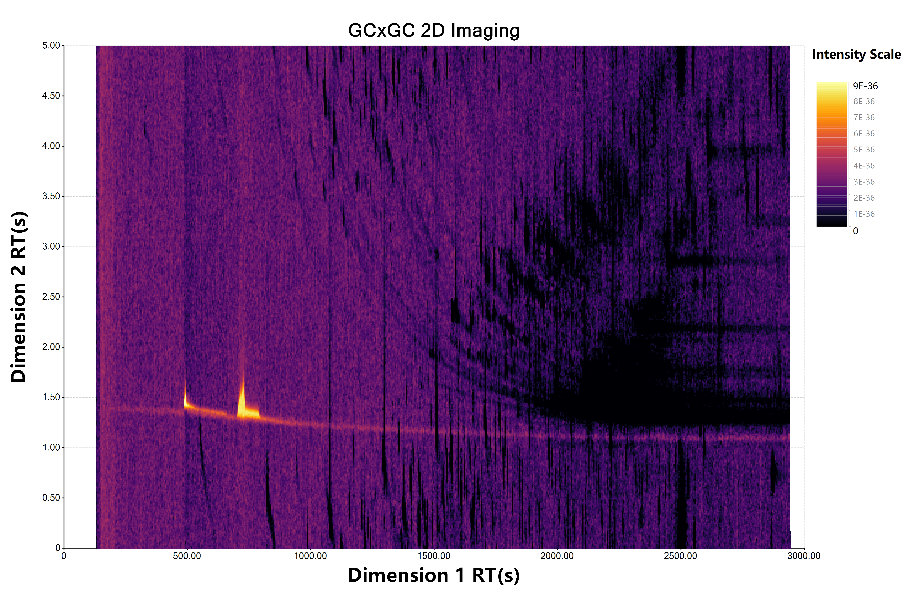

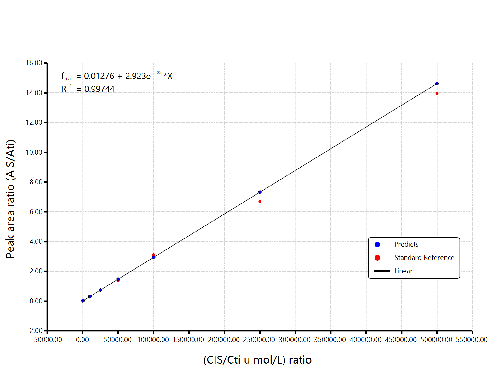


<div style="page-break-after:always;"></div>

##  1. <a name='RawDataViewerInstruction'></a>Raw Data Viewer Instruction

**Important Note: this application only supports the open source ``mzXML/mzML/imzML`` raw data file formats. For view the data in the vendor format file like the ``Thermo *.Raw`` required convert to the mzXML file format at first. It is recommended that convert the vendor format file to mzXML via [ProteoWizard](https://github.com/ProteoWizard/pwiz).**

###  1.1. <a name='Importsrawdatafile'></a>Imports raw data file

For view the file content of the mzXML or mzML datafile in mzkit, you must imports the raw data file into the mzkit at first. Here is how: select the ``Main`` tabpage of mzkit you will see the ``Open`` command for the raw data imports operation. Then you are going to click this ``Open`` command button, choose the raw data file for imports and wait for it finished. 


Then you should see the files that you've imports into mzkit on the ``File Explorer`` dock panel if there is no error occurs during the raw data file imports progress. Now you can click on the raw data file tree to expend it and click one of the feature in your raw file to view the content data.


####  1.1.1. <a name='BackgroundTask'></a>Background Task

For improvements of the user experience when you are using the mzkit application, the raw data files is imports to mzkit application under a background task. You can see the background task progress throught the ``Task List`` window:


<div style="page-break-after:always;"></div>

###  1.2. <a name='SearchFeature'></a>Search Feature

the search bar on the top of the file tree is the ``m/z`` search input: you can input a specific ``m/z`` value or ``formula`` expression in the search bar for search the matched features in your raw data file. This operation is usually apply for the ``XIC`` data search.

When you have click on the search button, then all of the ``M/z`` feature in your raw data file that match the ``ppm`` condition will be listed in the ``Featrue List`` dock panel:


> An example of search m/z 834.6 with tolerance error 30ppm. the result in the ``Feature List`` is usually used for create a XCI plot.

###  1.3. <a name='XICplot'></a>XIC plot

Expends the file content tree in the ``File Explorer``, and then mouse right click on one MS2 feature in your file, select ``XIC`` for create a XIC plot for a specific ion feature:


> The XIC plot is a kind of time-signal chromatography plot of a specific m/z ion.

<div style="page-break-after:always;"></div>

####  1.3.1. <a name='XICoverlay'></a>XIC overlay

you can click on the checkbox besides the Ms2 feature for select different ion feature for create the XIC overlay plot:


###  1.4. <a name='TICplot'></a>TIC plot

as the same as create a XIC plot, you also can create TIC plot for a single file or multiple file by select multiple file by check on checkbox:


> The TIC plot is similar to the XIC plot, data is generated from all ions.

<div style="page-break-after:always;"></div>

###  1.5. <a name='RawScatter'></a>Raw Scatter

just click on the node of the raw file, then you will open the raw scatter plot of your specific raw data file, example as:

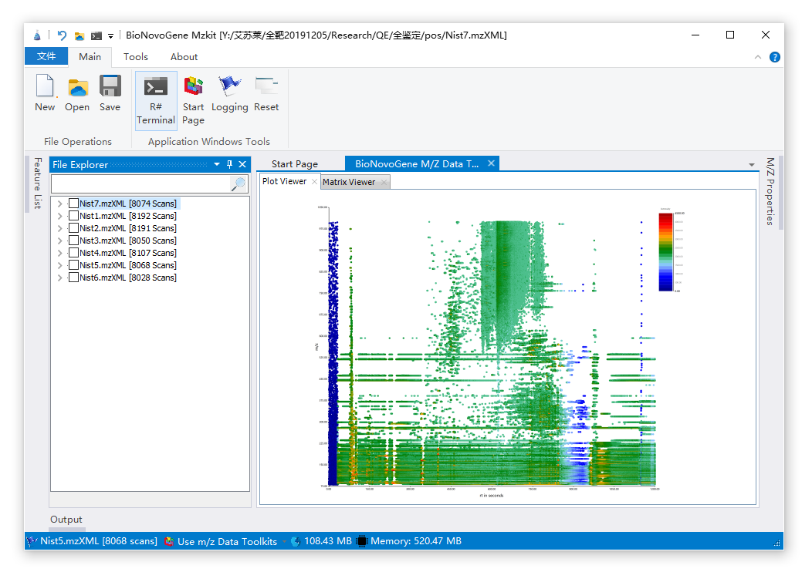

###  1.6. <a name='ViewMassspectra'></a>View Mass spectra

For view the mass spectra data in your file, just click on one of the scan feature in your raw data file:


###  1.7. <a name='SavePlotandExportmatrix'></a>Save Plot and Export matrix

The mzkit application provides the function for save the plot image and the plot data in your raw data file. for example, select the ``Data Viewer`` tab page in mzkit, you will see two viewer action buttons in the menu:

1. [``Snapshot``] for export the XIC/TIC/MS2 data plot image to a specific file.
2. [``Save Matrix``] for export the Mass spectra or Chromatography data to a specific Excel table file.

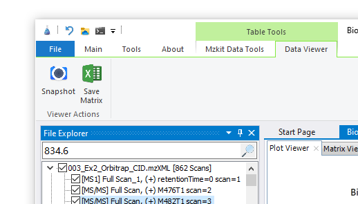

####  1.7.1. <a name='ExportXIC'></a>Export XIC

Export the XIC data to a specific file is also keeps simple, just mouse right click on the file content tree and then choose ``Export XIC Ions``.


<div style="page-break-after:always;"></div>

###  1.8. <a name='Ms-Imaging' id="Ms-Imaging">Ms-Imaging</a>

mzkit software is also supports the ``imzML`` file format for run ms-imaging rendering, here is how to view the imzML raw data file in mzkit application:

a. click of the open button on the file menu:

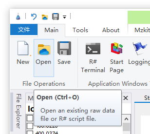

b. then you will see a pop out dialog for select raw data file, select the ``imzML`` file format in the file fiter, like:

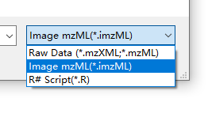

c. after the imzML raw data file has been imported into mzkit, then a raw data view for ms-imaging will be open, it looks like:


<div style="page-break-after:always;"></div>

two components for view ms-imaging contains:

+ ``[MsImaging Parameters]`` Panel for select ions and adjust rendering parameters.
+ ``[MS-Imaging Viewer]`` tab page for show the rendering image output of the selected ions.

d. select target ions in the explorer panel, and then mouse right click on the ions, select ``rendering`` menu item for run ms-imaging rendering:

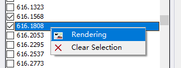

e. finally, you will see the imaging on the ``[MS-Imaging Viewer]`` tab page after loading pixels data from the related ``ibd`` data files:


f. you can tweaks of the image from the ``[MsImaging Parameters]`` Panel.


> change different color schema for rendering the MS-image in mzkit application.

##  2. <a name='DataAnnotations'></a>Data Annotations

###  2.1. <a name='Formulasearch'></a>Formula search

You can search for the formula of one feature in your raw data file with mzkit for do some de-novo annotation with just simply mouse right click on one of the feature and then select ``Search Formula``, and then wait for a while to let mzkit for search all of the candidate formula by enumerates all of the possible element combinations:


Once the mzkit have been done of formula search, then all of the matched formula will be shown on the result page. there are some information about the each formula search result is listed in the result table, includes: formula result, its corresponding exact mass value, mass error of the searched m/z and the m/z calculated from the exact mass, ion charge value from your raw file, precursor type information, etc.


You also can search of the formula by input any ``m/z`` value in the input box of the search result page. Click on the formula then you could submit the candidate formula into the biodeep database for search of the metabolite information.

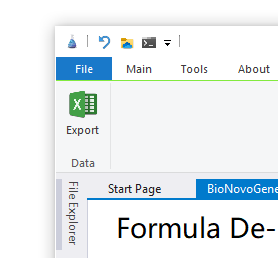

####  2.1.1. <a name='ExportFormulaSearchResult'></a>Export Formula Search Result

Export the formula search result just like other data that we've introduced before, just click on the ``Formula Result`` tab page and then click on the Export button. this command will let you save the formula search result into a specific Excel table file. 

<div style="page-break-after:always;"></div>

###  2.2. <a name='MolecularNetworking'></a>Molecular Networking

The molecular networking in mass spectrum data is a kind of spectrum similarity network. You can build a molecule network use mzkit in a very easy way:

####  2.2.1. <a name='step1selections'></a>step1 select ions

For create a spectrum similarity network, it required some ms2 ions data provides to mzkit for run spectrum matrix alignment and evaluate the simialrity scores between these spectrum matrix data. select the ions data just like plot XIC operation it does in mzkit: check on the ms2 feature in the ``file explorer`` dock panel.

####  2.2.2. <a name='step2buildnetwork'></a>step2 build network

Once we have the mass spectrum data selected, then we could run the matrix similarity between these matrix for build a network. now we mouse right click of the file tree in the ``file explorer``, and then choose the ``Molecular Networking`` menu item:

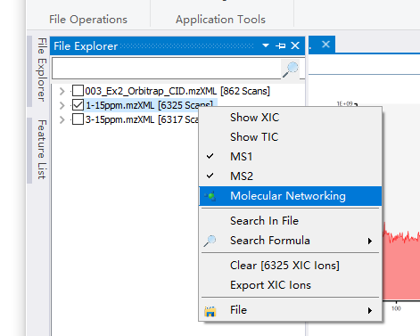

####  2.2.3. <a name='step3viewnetworkdata'></a>step3 view network data

once the networking progress have been done, then we could view the network result data in the ``Molecular Networking`` tool page. there are three tables in the tool page for show your network data: ``Network``, ``Compounds`` and ``Network Statistics``.


+ 1. the ``Network`` tab page contains the edges data in your network, which is the spectrum cluster simialrity result. all of the spectrum alignment its simialrity value is less than the ``Spectrum Similarity`` threshold value that will be removes from the network.

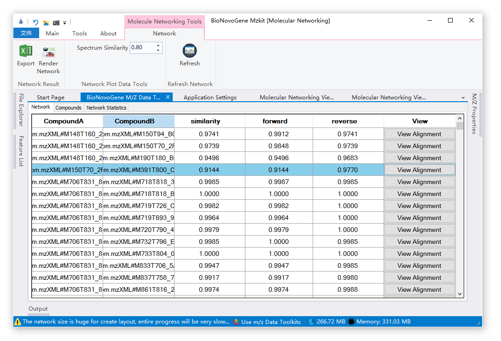

there are columns in the edge table: ``CompoundA`` and ``CompoundB`` is the spectrum reference id in this edge connected. and the ``simialrity``, ``forward`` and ``reverse`` column is the simialrity score value of the two spectrum matrix and the last ``View`` column contains the button that let you view the spectrum matrix alignment result visual plot.

+ 2. the ``Compounds`` tab page contains the spectrum cluster (**network nodes**) information in your network.

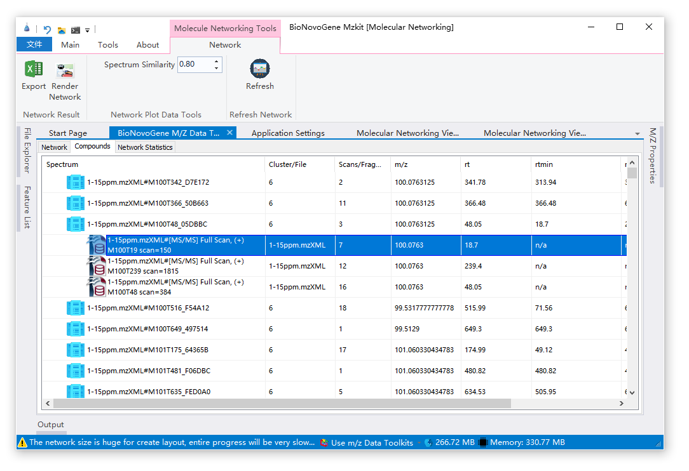

####  2.2.4. <a name='step4networkvisualization'></a>step4 network visualization

The mzkit program provides a small build-in network visualization engine that could let you visual the resulted molecular network with just a simple mouse click. As you can see in the previous screenshot, there is a ``Render Network`` command button on the top menu when the ``Network`` tab is actived. No we just click on it, and wait for the network layout calculation progress complete, and then we will see a new tag page which is named ``Molecular Networking Viewer`` will be shown in the document area of the mzkit program.

####  2.2.5. <a name='ExportNetworkData'></a>Export Network Data

There is not too much style tweaking in the mzkit build-in network visualizer, so that you may be want to export the network data into table and then visualize it in other network visualization software like the famous ``Cytoscape``.

Just click on the ``Export`` command button beside the ``Render Network`` button in the ``Network`` menu tab, then a dialog of save network data will be trigger and opened. Select a location in the dialog and then you can save the network table data into a given location for visualization in other software.

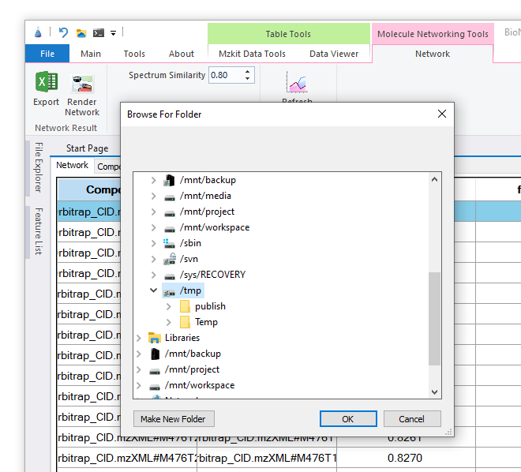

<div style="page-break-after:always;"></div>

####  2.2.6. <a name='SaveNetworkVisual'></a>Save Network Visual

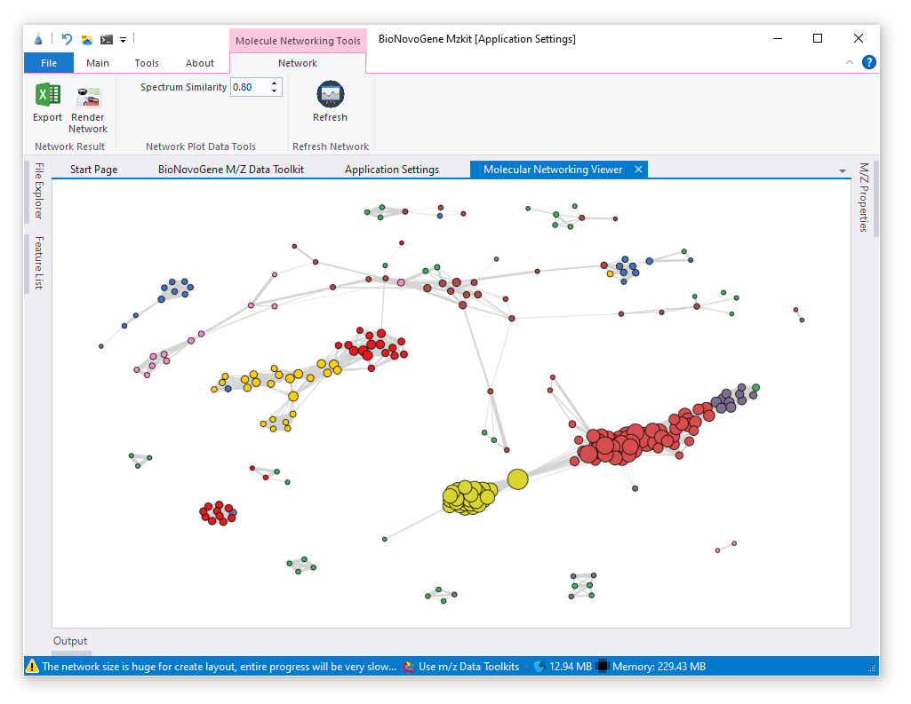

For export the network image, just mouse right click on the viewer panel, then you could see a popout menu ``Save Image`` that could use for viewer image saved.


You also can save the network image via ``Save`` command in the ``Main`` menu tab page when the molecular networking viewer is current active document page in mzkit program.


Now you can use the saved network image for your publications:

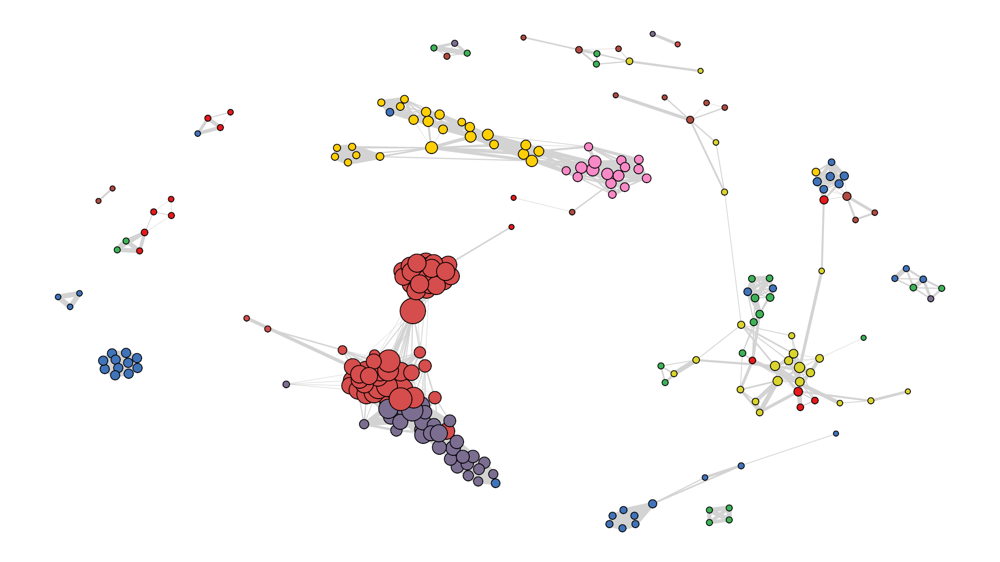

<div style="page-break-after:always;"></div>

## Targeted Data Quantification


### Introduce Ions Library


### Use the Quantify Analysis Tools

#### Linear Modelling

For evaluate the quantify content result of the target compounds in your samples. You must create the linear models for the target compounds at first. The targeted quantification tools in mzkit contains the function for create linear models of LCMSMS MRM data and the GCMS SIM data.

> NOTE about sample names in linear reference:
> 1. It is recommended name your linear reference samples in patterns like ``L-<level>``, examples as: ``L-1``, ``L-2``, ``L-3``, ``...``.
> 2. and using the content value like ``100ppm``, ``50ppb`` as the sample file name is also recommended. 

#### Sample Quantify

<div style="page-break-after:always;"></div>

##  3. <a name='Appendix'></a>Appendix

###  3.1. <a name='SwitchBetweenToolkit'></a>Switch Between Toolkit

You can switch between toolkit pages via the start menu of mzkit:


> click ``[File]`` -> ``[Mzkit Data Toolkits]``, and then click on one toolkit item then you can switch to the required toolkit page.

or just select a page from the app switcher toolstrip menu:

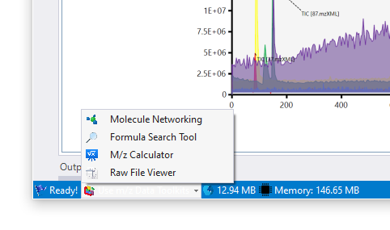

<div style="page-break-after:always;"></div>

###  3.2. <a name='InstallMzkit'></a>Install Mzkit

> If you have already installed the mzkit application, please uninstall the previous version before you install the new version of the mzkit application.

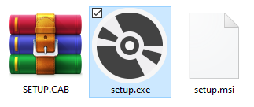

When you have extract the zip package of the mzkit compression package, then you could found a ``setup.exe`` install application in the top of folder. Click on this setup application, then your will going to install mzkit program into your computer system.


When you have launch the mzkit installer, then you will see a security warning dialog from your windows system, just click on the ``Install`` for start the install progress, and then just needs to wait for the installer finish the progress of copy the mzkit application files.


<div style="page-break-after:always;"></div>

###  3.3. <a name='UninstallMzkit'></a>Uninstall Mzkit

if you want to removes mzkit from your computer system, then you could follow this instruction for uninstall:

1. Open the control panel of your windows system, and then click of the link ``Uninstall a program``


2. Then you will see a list of program that installed on your windows, located the mzkit application


3. Then right click on the mzkit, select ``uninstall``, then you can removes mzkit from your windows system


Just click ``OK`` on the dialog:

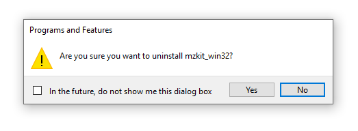

<style type="text/css">
	#content-wrapper {
		background-color: white !important;    
	}
</style>

<script type="text/javascript">
	document.ready = function() {
		document.getElementById("sidebar").style.display = "none";
	}
</script>

### Credit

GUI Framework library of mzkit_win32 software:

+ Windows Ribbon: https://github.com/harborsiem/WindowsRibbon
+ DockPanel: https://github.com/dockpanelsuite/dockpanelsuite

### Reference

+ X. Shen, R. Wang, X. Xiong, Y. Yin, Y. Cai, Z. Ma, N. Liu, and Z.-J. Zhu* (Corresponding Author), Metabolic Reaction Network-based Recursive Metabolite Annotation for Untargeted Metabolomics, Nature Communications, 2019, 10: 1516.
+ Li S, Park Y, Duraisingham S, Strobel FH, Khan N, et al. (2013) Predicting Network Activity from High Throughput Metabolomics. PLOS Computational Biology 9(7): e1003123. https://doi.org/10.1371/journal.pcbi.1003123
+ Pang, Z., Chong, J., Zhou, G., Morais D., Chang, L., Barrette, M., Gauthier, C., Jacques, PE., Li, S., and Xia, J. (2021) MetaboAnalyst 5.0: narrowing the gap between raw spectra and functional insights Nucl. Acids Res. (doi: 10.1093/nar/gkab382)
+ Ogata, H., Goto, S., Sato, K., Fujibuchi, W., Bono, H., & Kanehisa, M. (1999). KEGG: Kyoto Encyclopedia of Genes and Genomes. Nucleic acids research, 27(1), 29–34. https://doi.org/10.1093/nar/27.1.29
+ Tsugawa, H., Cajka, T., Kind, T., Ma, Y., Higgins, B., Ikeda, K., Kanazawa, M., VanderGheynst, J., Fiehn, O., & Arita, M. (2015). MS-DIAL: data-independent MS/MS deconvolution for comprehensive metabolome analysis. Nature methods, 12(6), 523–526. https://doi.org/10.1038/nmeth.3393
