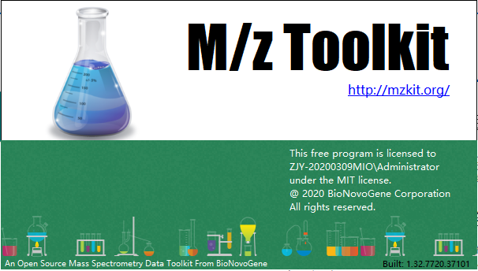
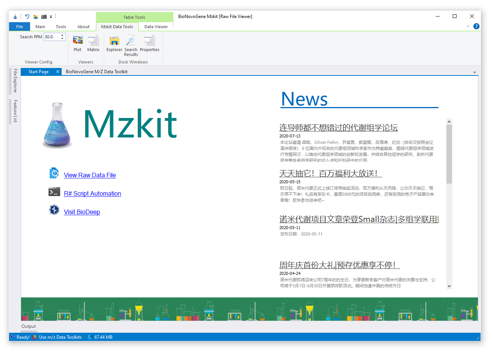
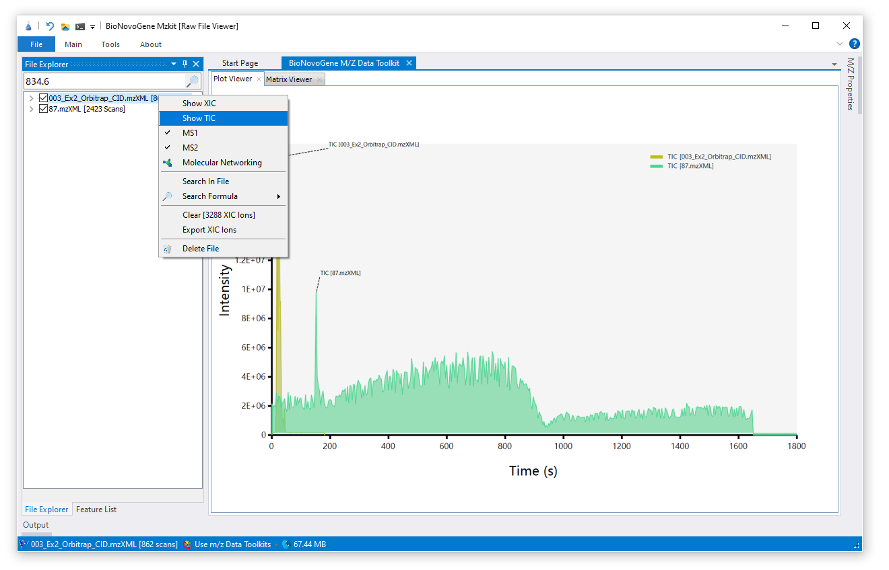

# Mzkit

--==== TOC ====--

<!-- vscode-markdown-toc -->
* 1. [Raw Data Viewer Instruction](#RawDataViewerInstruction)
	* 1.1. [Imports raw data file](#Importsrawdatafile)
	* 1.2. [Search Feature](#SearchFeature)
	* 1.3. [XIC plot](#XICplot)

		* 1.3.1. [XIC overlay](#XICoverlay)

	* 1.4. [TIC plot](#TICplot)
	* 1.5. [View Mass spectra](#ViewMassspectra)
	* 1.6. [Save Plot and Export matrix](#SavePlotandExportmatrix)

		* 1.6.1. [Export XIC](#ExportXIC)

* 2. [Data Annotations](#DataAnnotations)
	* 2.1. [Formula search](#Formulasearch)
	* 2.2. [Export Formula Search Result](#ExportFormulaSearchResult)
* 3. [Credits](#Credits)

<!-- vscode-markdown-toc-config
	numbering=true
	autoSave=true
	/vscode-markdown-toc-config -->
<!-- /vscode-markdown-toc -->

Mzkit is an open source raw data file toolkit for mass spectrometry data analysis, provides by the ``BioNovoGene`` corporation. The features of mzkit inlcudes: raw data file content viewer(XIC/TIC/Mass spectrum plot), build molecule network, formula de-novo search and annotation.

##  1. Raw Data Viewer Instruction

###  1.1. Imports raw data file

For view the file content of the mzXML or mzML datafile in mzkit, you must imports the raw data file into the mzkit at first. Here is how: select the ``Main`` tabpage of mzkit you will see the ``Open`` command for the raw data imports operation. Then you are going to click this ``Open`` command button, choose the raw data file for imports and wait for it finished. 

Then you should see the files that you've imports into mzkit on the ``File Explorer`` dock panel if there is no error occurs during the raw data file imports progress. Now you can click on the raw data file tree to expend it and click one of the feature in your raw file to view the content data.

###  1.2. Search Feature

the search bar on the top of the file tree is the ``m/z`` search input: you can input a specific ``m/z`` value or ``formula`` expression in the search bar for search the matched features in your raw data file. This operation is usually apply for the ``XIC`` data search.

When you have click on the search button, then all of the ``M/z`` feature in your raw data file that match the ``ppm`` condition will be listed in the ``Featrue List`` dock panel:

> An example of search m/z 834.6 with tolerance error 30ppm. the result in the ``Feature List`` is usually used for create a XCI plot.

###  1.3. XIC plot

Expends the file content tree in the ``File Explorer``, and then mouse right click on one MS2 feature in your file, select ``XIC`` for create a XIC plot for a specific ion feature:

####  1.3.1. XIC overlay

you can click on the checkbox besides the Ms2 feature for select different ion feature for create the XIC overlay plot:

###  1.4. TIC plot

as the same as create a XIC plot, you also can create TIC plot for a single file or multiple file by select multiple file by check on checkbox:

###  1.5. View Mass spectra

For view the mass spectra data in your file, just click on one of the scan feature in your raw data file:

###  1.6. Save Plot and Export matrix

The mzkit application provides the function for save the plot image and the plot data in your raw data file. for example, select the ``Data Viewer`` tab page in mzkit, you will see two viewer action buttons in the menu:

1. [``Snapshot``] for export the XIC/TIC/MS2 data plot image to a specific file.
2. [``Save Matrix``] for export the Mass spectra or Chromatography data to a specific Excel table file.

####  1.6.1. Export XIC

Export the XIC data to a specific file is also keeps simple, just mouse right click on the file content tree and then choose ``Export XIC Ions``.

##  2. Data Annotations

###  2.1. Formula search

You can search for the formula of one feature in your raw data file with mzkit for do some de-novo annotation with just simply mouse right click on one of the feature and then select ``Search Formula``, and then wait for a while to let mzkit for search all of the candidate formula by enumerates all of the possible element combinations:

Once the mzkit have been done of formula search, then all of the matched formula will be shown on the result page. there are some information about the each formula search result is listed in the result table, includes: formula result, its corresponding exact mass value, mass error of the searched m/z and the m/z calculated from the exact mass, ion charge value from your raw file, precursor type information, etc.

You also can search of the formula by input any ``m/z`` value in the input box of the search result page. Click on the formula then you could submit the candidate formula into the biodeep database for search of the metabolite information.

###  2.2. Export Formula Search Result

Export the formula search result just like other data that we've introduced before, just click on the ``Formula Result`` tab page and then click on the Export button. this command will let you save the formula search result into a specific Excel table file. 

##  3. Credits

This open source mass spectrometry data toolkit is developed at the BioDeep R&D laboratory and provided to you by BioNovoGene corporation.

